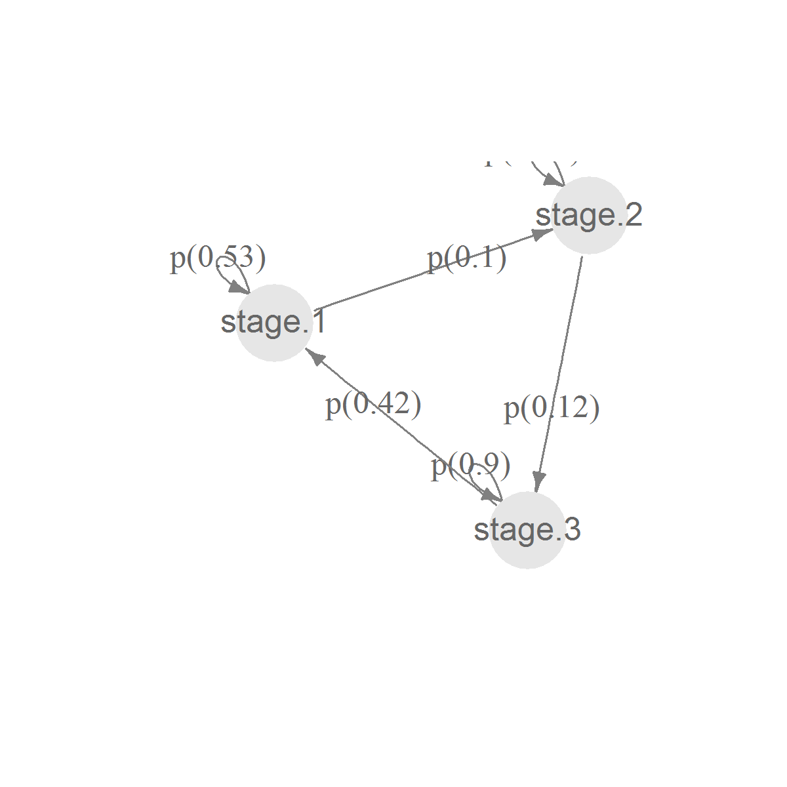
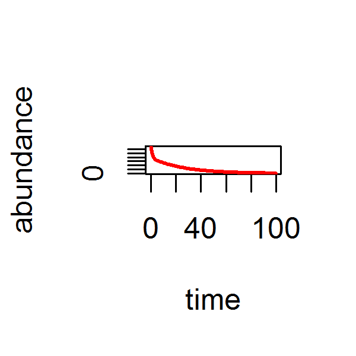
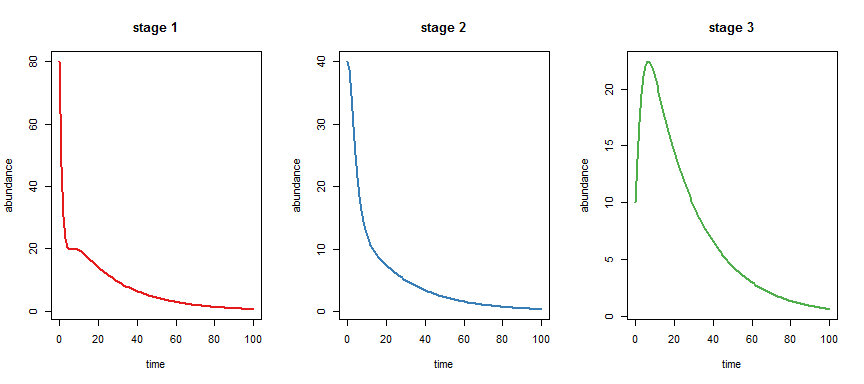
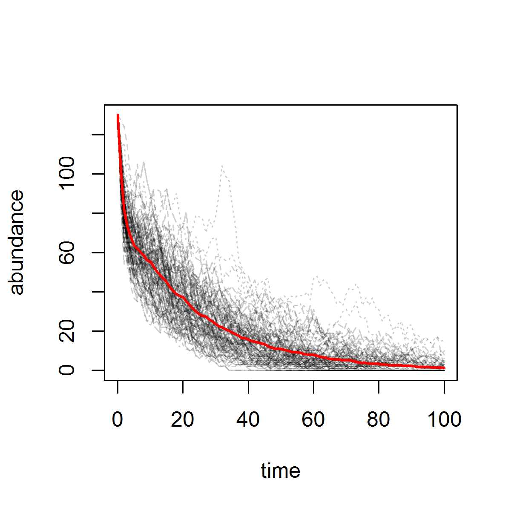
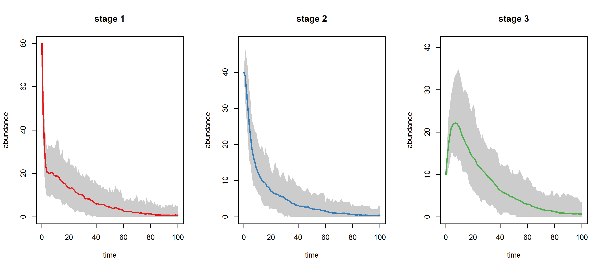

[](https://travis-ci.org/skiptoniam/dlmpr) [](https://codecov.io/github/skiptoniam/dlmpr?branch=master) \#\# dlmpr is an r package for simulating dynamic landscape meta-population models.

The package aims to develop a dynamic landscape meta-population models in R using a modular framework.

``` r
devtools::install_github('skiptoniam/dlmpr')
```

Because we are interested in matrix population models (or stage based models) we have develop a matrix population model for a single population. He I have generated a simple example of matrix population with three stages.

``` r
library(dlmpr)
tmat <- as.transition_matrix(matrix(c(.53,0,.42,0.1,0.77,0,0,0.12,0.9),nrow = 3,ncol = 3,byrow = TRUE))
```

We can now look at the standard matrix population metrics for this population.

``` r
summary(tmat)
```

    ## $lambda
    ## [1] 0.961153
    ## 
    ## $stable.stage.distribution
    ## [1] 0.3922036 0.2051778 0.4026185
    ## 
    ## $reproductive.value
    ## [1] 1.000000 4.311530 6.868017
    ## 
    ## $sensitivity
    ##            [,1]       [,2]       [,3]
    ## [1,] 0.09703147 0.05076115 0.09960813
    ## [2,] 0.41835413 0.21885823 0.42946344
    ## [3,] 0.66641380 0.34862844 0.68411030
    ## 
    ## $elasticity
    ##            stage.1    stage.2    stage.3
    ## stage.1 0.05350520 0.00000000 0.04352628
    ## stage.2 0.04352628 0.17533196 0.00000000
    ## stage.3 0.00000000 0.04352628 0.64058402
    ## attr(,"class")
    ## [1] "transition_matrix" "matrix"           
    ## 
    ## $name.mat
    ## [1] "tmat"
    ## 
    ## $m.names
    ## [1] "stage.1" "stage.2" "stage.3"
    ## 
    ## attr(,"class")
    ## [1] "summary.transition_matrix" "list"

We can also plot the population dynamics based on our population matrix.

``` r
plot(tmat)
```



Having assessed the matric population model for this population we can look at how a population will shift over time.

``` r
tmat <- as.transition_matrix(matrix(c(.53,0,.42,0.1,0.77,0,0,0.12,0.9),nrow = 3,ncol = 3,byrow = TRUE))
# we can add noise to each transition in the matrix as follows
matsd <- tmat/10
tmat_results <- summary(tmat)
v0 <-   c(80,40,10)
dm1 <- demographic(v0=v0,tmat=tmat,time=100,nrep=100)
```

We can now look at how this single population changes over time.

``` r
plot(dm1)
```



We can all see the different stages in the population structure change through time.

``` r
plot(dm1,mean_pop = FALSE)
```



Have assessed how the population changes over time, we can include stochastisty to our projections of population change through time. Here we include demographic uncertainty to each step in the stage based model by including `matsd` in to the demographic model run.

``` r
tmat <- as.transition_matrix(matrix(c(.53,0,.42,0.1,0.77,0,0,0.12,0.9),nrow = 3,ncol = 3,byrow = TRUE))
# we can add noise to each transition in the matrix as follows
matsd <- tmat/10
tmat_results <- summary(tmat)
v0 <-   c(80,40,10)
dm2 <- demographic(v0=v0,tmat=tmat,matsd = matsd, estdem = TRUE,time=100,nrep=100)
```

We can now look at how this single population changes over time with demograhic uncertainty.

``` r
plot(dm2)
```



We can all see the different stages in the population structure change through time with demograhic uncertainty.

``` r
plot(dm2,mean_pop = FALSE)
```


