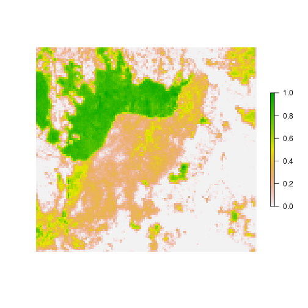
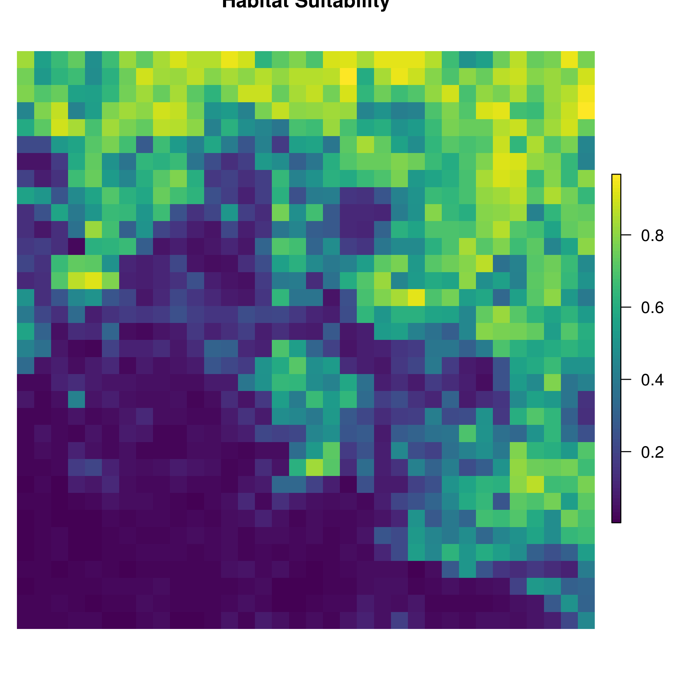
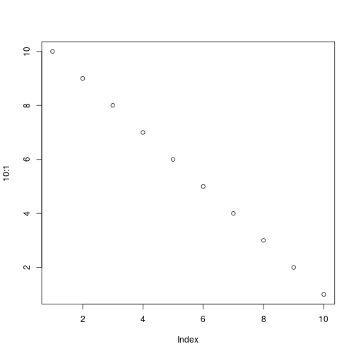

Here is a groove example of what this package can do.

First we are going to setup the stage based transition matricies. The first matrix represents survival and fecundity life-stage transition probabilities for koalas. The second matrix describes the uncertainty around the transition probabilities and is used to simulate environmental stochasticity - zeros indicate no uncertainty. Note, there are four life-stages and the matrix is symmetrical 


```r
koala.trans.mat <- matrix(c(0.000,0.000,0.302,0.302,
                              0.940,0.000,0.000,0.000,
                              0.000,0.884,0.000,0.000,
                              0.000,0.000,0.793,0.793),
                            nrow = 4, ncol = 4, byrow = TRUE)
colnames(koala.trans.mat) <- rownames(koala.trans.mat) <- c('Juveniles','Sub-Adults','Adults','Super-Adults')

koala.trans.mat.es <- matrix(c(0.000,0.000,1,1,
                                 1,0.000,0.000,0.000,
                                 0.000,1,0.000,0.000,
                                 0.000,0.000,1,1),
                               nrow = 4, ncol = 4, byrow = TRUE)
colnames(koala.trans.mat.es) <- rownames(koala.trans.mat.es) <- c('Juveniles','Sub-Adults','Adults','Super-Adults')
```

Read in spatial inputs to be used for the experiment and simulations. For the koala, a 117km x 126km spatial grid with a resolution of 1km2 is used as the landscape for the meta-population of koalas. Each cell represents patches that koalas can move between depending on the attributes of the cell.


```r
library(raster)
```

```
## Loading required package: sp
```

```
## 
## Attaching package: 'raster'
```

```
## The following object is masked from 'package:steps':
## 
##     extend
```

```r
# read in spatial habitat suitability raster
koala.hab.suit <- raster(system.file("extdata","Koala_HabSuit.tif", package="steps"))

# rescale habitat raster to relative suitability (or likelihood of occurrence) between 0 and 1.
koala.hab.suit <- (koala.hab.suit - cellStats(koala.hab.suit, min)) / (cellStats(koala.hab.suit, max) - cellStats(koala.hab.suit, min))

# rename raster so that it is traked throughout the experiment and simulation
names(koala.hab.suit) <- "Habitat"
plot(koala.hab.suit, box = FALSE, axes = FALSE)
```




The figure sizes have been customised so that you can easily put two images side-by-side. 


```r
plot(1:10)
plot(10:1)
```



